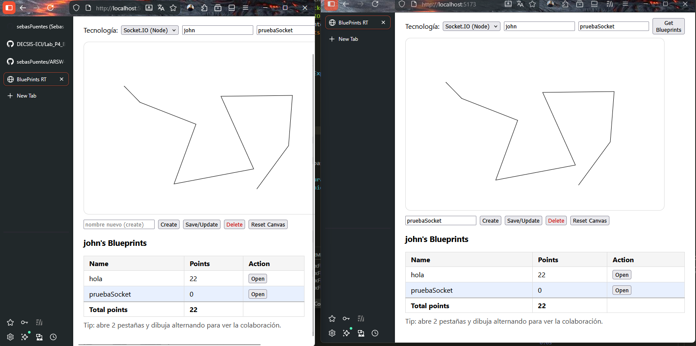

# ARSW LAB 04 - Backend Socket.IO (Node.js)

Backend Node.js con **Express** y **Socket.IO** que habilita colaboracion en tiempo real para el dibujo de blueprints.

## Descripcion

Servidorn que provee:

- **Proxy REST** para obtener el estado inicial de un blueprint desde la API Spring Boot
- **Socket.IO** para tiempo real: los clientes se unen a salas por plano y los puntos dibujados se retransmiten a todos los demas clientes en la misma sala

### Flujo de Tiempo Real

1. El cliente se conecta via Socket.IO a `http://localhost:3001`
2. Emite `join-room` con la sala `blueprints.{author}.{name}`
3. Al dibujar, emite `draw-event` con `{ room, author, name, point: {x, y} }`
4. El servidor hace broadcast de `blueprint-update` a los demas clientes de la sala

## Requisitos Previos

- **Node.js v18+**
- **npm**
- API REST corriendo en `http://localhost:8080` (ver [ARSW-LAB04-API](https://github.com/sebasPuentes/ARSW-LAB04-API))

## Instalacion y Ejecucion

1. **Instalar dependencias**

   ```bash
   npm install
   ```

2. **Ejecutar en modo desarrollo**

   ```bash
   npm run dev
   ```

   El servidor estara disponible en `http://localhost:3001`.

## Eventos Socket.IO

| Direccion | Evento | Payload |
|-----------|--------|---------|
| Cliente -> Servidor | `join-room` | `"blueprints.{author}.{name}"` |
| Cliente -> Servidor | `draw-event` | `{ room, author, name, point: { x, y } }` |
| Servidor -> Clientes | `blueprint-update` | `{ author, name, points: [{ x, y }] }` |


## Tecnologias

- **Node.js** + **Express**
- **Socket.IO**

---

## Evidencias



---

**Autor:** Juan Sebastian Puentes Julio

**ARSW - Arquitecturas de Software - Escuela Colombiana de Ingenieria Julio Garavito**
